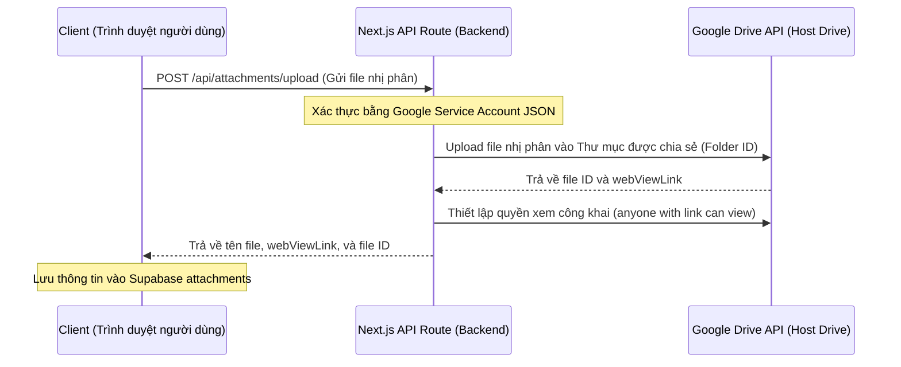

# Spec: Lưu trữ tệp tin tập trung trên Google Drive của Người host (Host-owned Drive)

Tài liệu này đặc tả thiết kế kỹ thuật cho phép lưu trữ tệp đính kèm tập trung trên một thư mục Google Drive duy nhất của người host. Người dùng cuối không cần đăng nhập Google, không cần tài khoản Drive, chỉ cần tải file lên và xem trực tiếp.

## 1. Nguyên lý hoạt động (Architectural Overview)

---

## 2. Các thành phần kỹ thuật cần thiết

### A. Google Service Account (Tài khoản dịch vụ)
- Thay vì dùng OAuth Client ID (đăng nhập bằng màn hình đồng ý), chúng ta sử dụng **Google Service Account**. Đây là một tài khoản robot đại diện cho server ứng dụng.
- Người host sẽ tạo một thư mục trên Google Drive của mình (ví dụ: `Pastel Kanban Attachments`) và **chia sẻ quyền "Editor"** cho email của Service Account này.
- Mọi file Service Account tải lên sẽ được đặt trong thư mục này và thuộc sở hữu chung của người host.

### B. Next.js API Route (`/api/attachments/upload`)
- Viết API Route để nhận file nhị phân tải lên dưới dạng `multipart/form-data`.
- Dùng thư viện `@googleapis/drive` hoặc gọi REST API của Google sử dụng JWT (JSON Web Token) ký bằng Private Key của Service Account để lấy Access Token.
- Thực hiện tải file lên Google Drive chỉ định thư mục cha (`parents: [FOLDER_ID]`).

### C. Giao diện Người dùng (UI/UX)
- Loại bỏ hoàn toàn Google OAuth Popup và SDK script (`gapi`, `gsi`) ở phía client.
- Người dùng chỉ thấy một nút duy nhất: `📎 Đính kèm tệp tin`.
- Khi chọn file, client gọi trực tiếp API `/api/attachments/upload` của chúng ta. Giao diện hiển thị thanh tiến trình tải lên bình thường.

---

## 3. Cấu hình Biến môi trường (.env.local)

Người host cần bổ sung các khóa bảo mật sau vào môi trường máy chủ (không bao giờ lộ ra Client):
- `GOOGLE_SERVICE_ACCOUNT_EMAIL`: Email của Service Account.
- `GOOGLE_PRIVATE_KEY`: Khóa riêng tư của Service Account.
- `GOOGLE_DRIVE_FOLDER_ID`: ID của thư mục Google Drive của host đã được chia sẻ quyền Editor cho Service Account.
