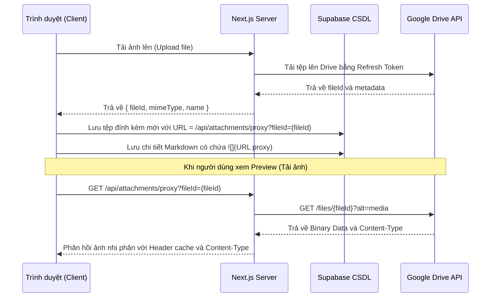

# Design Spec: Thiết kế Next.js API Proxy Cho Ảnh Drive & Tối Ưu Hóa Giao Diện Modal, Popover

Bản đặc tả thiết kế chi tiết để giải quyết triệt để lỗi không hiển thị hình ảnh từ Google Drive bằng cơ chế Server-side Proxy, cùng các tối ưu hóa giao diện (auto-resize mô tả & chi tiết khi chuyển tab, giới hạn chiều cao popover, ngắt dòng liên kết URL dài, đồng bộ Markdown cho mô tả công việc ở cả Modal và Popover, tăng tốc độ hiển thị popover, và hộp thoại phóng to ảnh Lightbox có hỗ trợ zoom phím Control).

---

## 1. Thành phần và Kiến trúc

### 1.1 API Proxy hình ảnh (`/api/attachments/proxy`)
- **Mục tiêu:** Cung cấp link ảnh trung gian từ server Next.js để trình duyệt tải trực tiếp, không qua domain Google Drive nhằm tránh bị chặn cookie.
- **Nguyên lý:**
  - Nhận tham số `fileId` từ query string.
  - Sử dụng Google OAuth credentials ở phía server (Refresh Token) để lấy Access Token.
  - Gọi API Google Drive lấy file nhị phân: `GET https://www.googleapis.com/drive/v3/files/{fileId}?alt=media`.
  - Stream dữ liệu file nhị phân về trình duyệt kèm `Content-Type` thích hợp và cấu hình cache client `Cache-Control`.
- **Cấu trúc URL mới trong Markdown:** `/api/attachments/proxy?fileId={fileId}`

### 1.2 Hộp thoại phóng to ảnh (Lightbox Viewer) & Zoom phím Control
- **Mục tiêu:** Cho phép người dùng bấm vào ảnh trong Markdown Preview (Mô tả/Chi tiết) hoặc danh sách File đính kèm để xem phóng to ngay trên màn hình và zoom bằng cách giữ phím Control + cuộn chuột.
- **Nguyên lý:**
  - Định nghĩa state `lightboxImageUrl: string | null` ở cả `CardDetailModal.tsx` và `CardPopover.tsx`.
  - Định nghĩa state `scale: number` (mặc định = 1) để điều chỉnh mức độ phóng to của ảnh.
  - Sử dụng Event Delegation trên các container Markdown Preview để bắt sự kiện click thẻ ``, ngăn cản chuyển tab soạn thảo và mở Lightbox.
  - Sử dụng **React Portal (`createPortal`)** để render Lightbox vào `document.body` nhằm tránh lỗi mouseleave của CardPopover và các xung đột z-index.
  - Gắn sự kiện `wheel` không passive lên overlay Lightbox bằng `useEffect`: khi người dùng cuộn chuột + giữ phím `Control` (`e.ctrlKey === true`), ngăn sự kiện zoom mặc định của trình duyệt (`e.preventDefault()`) và cập nhật `scale` từ `0.5x` đến `5x`.
  - Thiết lập trạng thái `isBusy` của Popover bao gồm cả việc Lightbox đang mở để chặn Popover tự động ẩn:
    `const isBusy = uploadingFile !== null || deletingIds.length > 0 || lightboxImageUrl !== null;`

### 1.3 Đồng bộ hóa 2 Bộ Soạn thảo Markdown & Auto-save trong Modal
- Cả **Mô tả công việc** và **Chi tiết công việc** trong Modal đều dùng chung thiết kế soạn thảo:
  - Có thanh công cụ (Toolbar) chứa nút chèn ảnh và hướng dẫn dán/kéo thả.
  - Tích hợp sự kiện paste ảnh từ clipboard (`paste`) và upload ảnh để lưu vào danh sách File đính kèm.
  - Có nút chuyển đổi Soạn thảo / Xem trước (mặc định cả Mô tả và Chi tiết đều mở Xem trước khi Modal mở lên).
- Áp dụng cơ chế **Auto-resize** tự co giãn chiều cao cho cả 2 textarea (`descRef` cho Mô tả, `textareaRef` cho Chi tiết) dựa trên `scrollHeight` và sự thay đổi của tab hiện tại (`isDescPreview` & `isPreviewMode`). Khi chuyển sang chế độ Soạn thảo, textarea lập tức co giãn để hiển thị đầy đủ văn bản mà không có thanh cuộn nội bộ.

### 1.4 Giới hạn chiều cao, định vị và tăng tốc hiển thị Popover (Card Hover Popover)
- **Mục tiêu:** Ngăn không cho Popover của thẻ hiển thị tràn xuống dưới cạnh màn hình gây mất nội dung, đồng thời hiển thị và đóng tức thì.
- **Nguyên lý:**
  - Cập nhật CSS class của Popover trong [CardPopover.tsx](file:///c:/WORKSPACE/TaskManagementWeb/my-task-app/src/components/CardPopover.tsx), đặt `max-h-[80vh] overflow-y-auto` để tự xuất hiện thanh cuộn dọc khi Popover quá dài.
  - Tự động mọc ngược lên (`grow upwards`) sử dụng `bottom` khi card ở nửa dưới màn hình (`isLowerHalf = true`).
  - **Tăng tốc phản hồi (Fast Response):** Loại bỏ lớp transition chậm chạp `transition-all duration-200` khỏi Popover. Rút ngắn thời gian timeout chờ đóng từ `200ms` xuống `100ms` trong [page.tsx](file:///c:/WORKSPACE/TaskManagementWeb/my-task-app/src/app/board/%5Bid%5D/page.tsx).

### 1.5 Khắc phục lỗi tràn chữ có chọn lọc (Selective Word Wrap / URL Break All)
- **Mục tiêu:** Bẻ dòng triệt để cho các liên kết URL dài mà không xẻ đôi từ ngữ thông thường.
- **Nguyên lý:**
  - Áp dụng bẻ dòng thông thường theo từ (`word-break: break-word`) cho chữ văn bản thông thường và các `textarea`.
  - Chỉ áp dụng bẻ dòng triệt để (`word-break: break-all`) cho thẻ liên kết `<a>` trong phần Preview Markdown.

---

## 2. Luồng xử lý và Tương tác (Sequence & Data Flow)

---

## 3. Kế hoạch kiểm thử & Xác minh
- **Kiểm thử Zoom phím Control:** Mở Lightbox, giữ phím Ctrl và cuộn chuột lên/xuống, kiểm tra xem ảnh có phóng to/thu nhỏ tương ứng trong khoảng 0.5x - 5x mà không làm zoom toàn bộ trang web.
- **Kiểm thử chuột rời khỏi Popover:** Mở Lightbox từ Popover di chuột ngoài bảng, di chuột ra ngoài khu vực Popover để đóng hoặc phóng to, xác minh Popover vẫn hiển thị nguyên vẹn cho đến khi đóng Lightbox.
