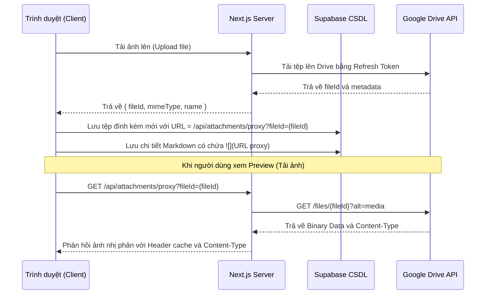

# Design Spec: Thiết kế Next.js API Proxy Cho Ảnh Drive & Tối Ưu Hóa Giao Diện Modal, Popover

Bản đặc tả thiết kế chi tiết để giải quyết triệt để lỗi không hiển thị hình ảnh từ Google Drive bằng cơ chế Server-side Proxy, cùng các tối ưu hóa giao diện (auto-resize mô tả, giới hạn chiều cao popover, ngắt dòng văn bản).

---

## 1. Thành phần và Kiến trúc

### 1.1 API Proxy hình ảnh (`/api/attachments/proxy`)
- **Mục tiêu:** Cung cấp link ảnh trung gian từ server Next.js để trình duyệt tải trực tiếp, không qua domain Google Drive nhằm tránh bị chặn cookie.
- **Nguyên lý:**
  - Nhận tham số `fileId` từ query string.
  - Sử dụng Google OAuth credentials ở phía server (Refresh Token) để lấy Access Token.
  - Gọi API Google Drive lấy file nhị phân: `GET https://www.googleapis.com/drive/v3/files/{fileId}?alt=media`.
  - Stream dữ liệu file nhị phân về trình duyệt kèm `Content-Type` thích hợp và cấu hình cache client `Cache-Control`.
- **Cấu trúc URL mới trong Markdown:** `/api/attachments/proxy?fileId={fileId}`

### 1.2 Tự động co giãn mô tả công việc (Auto-resize Description Textarea)
- **Mục tiêu:** Textarea của phần mô tả công việc sẽ tự tăng/giảm chiều cao theo lượng văn bản bên trong, tránh việc hiển thị thanh cuộn nội bộ gây khó chịu và giúp giao diện liền mạch.
- **Nguyên lý:** Sử dụng React `useRef` và một `useEffect` theo dõi biến `content` để set `height = scrollHeight + 'px'`.

### 1.3 Giới hạn chiều cao và thanh cuộn cho Popover (Card Hover Popover)
- **Mục tiêu:** Ngăn không cho Popover của thẻ hiển thị tràn xuống dưới cạnh màn hình gây mất nội dung.
- **Nguyên lý:** Cập nhật CSS class của Popover trong [CardPopover.tsx](file:///c:/WORKSPACE/TaskManagementWeb/my-task-app/src/components/CardPopover.tsx), đặt `max-h-[80vh] overflow-y-auto` để tự xuất hiện thanh cuộn dọc khi Popover quá dài.

### 1.4 Khắc phục lỗi tràn chữ (Word Wrap / Break Words)
- **Mục tiêu:** Ngăn không cho các liên kết URL dài hoặc từ dài trong Markdown preview và Textarea phá vỡ chiều ngang container.
- **Nguyên lý:**
  - Bổ sung `word-break: break-word` và `overflow-wrap: break-word` cho `.markdown-content` trong [globals.css](file:///c:/WORKSPACE/TaskManagementWeb/my-task-app/src/app/globals.css).
  - Thêm class `break-words` vào các `textarea` trong [CardDetailModal.tsx](file:///c:/WORKSPACE/TaskManagementWeb/my-task-app/src/components/CardDetailModal.tsx).

---

## 2. Luồng xử lý và Tương tác (Sequence & Data Flow)

---

## 3. Kế hoạch kiểm thử & Xác minh
- **Kiểm thử Preview ảnh:** Biên tập chi tiết công việc, tải ảnh lên, chuyển sang chế độ Preview và xác minh ảnh được hiển thị trơn tru, không có lỗi console về 3rd-party cookies.
- **Kiểm thử Auto-resize:** Viết mô tả dài hơn 4 dòng và xác minh ô nhập mô tả giãn to ra đẩy phần chi tiết xuống dưới, không có thanh cuộn trong ô nhập.
- **Kiểm thử Popover:** Thêm nhiều file đính kèm và mô tả dài vào 1 card. Di chuột hover vào card đó và kiểm tra popover không tràn quá mép màn hình, có thanh cuộn dọc.
- **Kiểm thử Tràn chữ:** Dán một link URL rất dài không có khoảng trắng vào Markdown, chuyển sang Preview kiểm tra xem link có tự động ngắt dòng xuống dưới không.
