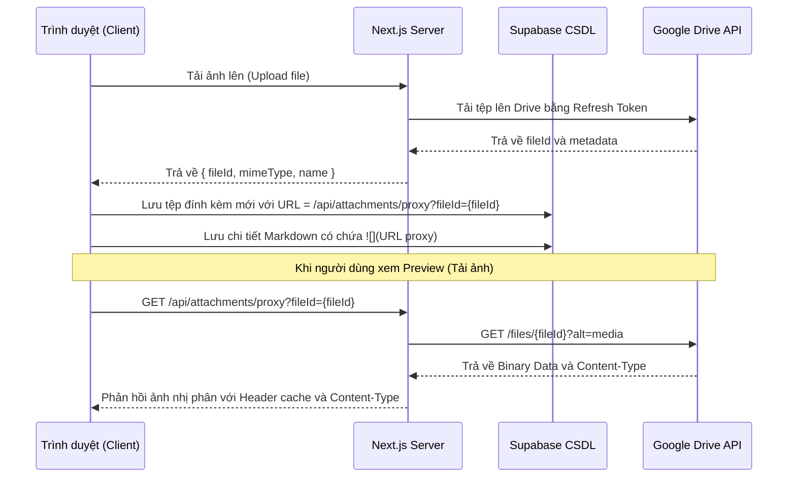

# Design Spec: Thiết kế Next.js API Proxy Cho Ảnh Drive & Tối Ưu Hóa Giao Diện Modal, Popover

Bản đặc tả thiết kế chi tiết để giải quyết triệt để lỗi không hiển thị hình ảnh từ Google Drive bằng cơ chế Server-side Proxy, cùng các tối ưu hóa giao diện (auto-resize mô tả & chi tiết, giới hạn chiều cao popover, ngắt dòng văn bản triệt để, đồng bộ Markdown cho mô tả công việc ở cả Modal và Popover).

---

## 1. Thành phần và Kiến trúc

### 1.1 API Proxy hình ảnh (`/api/attachments/proxy`)
- **Mục tiêu:** Cung cấp link ảnh trung gian từ server Next.js để trình duyệt tải trực tiếp, không qua domain Google Drive nhằm tránh bị chặn cookie.
- **Nguyên lý:**
  - Nhận tham số `fileId` từ query string.
  - Sử dụng Google OAuth credentials ở phía server (Refresh Token) để lấy Access Token.
  - Gọi API Google Drive lấy file nhị phân: `GET https://www.googleapis.com/drive/v3/files/{fileId}?alt=media`.
  - Stream dữ liệu file nhị phân về trình duyệt kèm `Content-Type` thích hợp và cấu hình cache client `Cache-Control`.
- **Cấu trúc URL mới trong Markdown:** `/api/attachments/proxy?fileId={fileId}`

### 1.2 Đồng bộ hóa 2 Bộ Soạn thảo Markdown & Auto-save trong Modal
- Cả **Mô tả công việc** và **Chi tiết công việc** trong Modal đều dùng chung thiết kế soạn thảo:
  - Có thanh công cụ (Toolbar) chứa nút chèn ảnh và hướng dẫn dán/kéo thả.
  - Tích hợp sự kiện paste ảnh từ clipboard (`paste`) và upload ảnh để lưu vào danh sách File đính kèm.
  - Có nút chuyển đổi Soạn thảo / Xem trước (mặc định Mô tả mở Xem trước, Chi tiết mở Soạn thảo).
- Áp dụng cơ chế **Auto-resize** tự co giãn chiều cao cho cả 2 textarea (`descRef` cho Mô tả, `textareaRef` cho Chi tiết) dựa trên `scrollHeight`. Không có thanh cuộn nội bộ trong 2 textarea này.

### 1.3 Giới hạn chiều cao và thanh cuộn cho Popover (Card Hover Popover)
- **Mục tiêu:** Ngăn không cho Popover của thẻ hiển thị tràn xuống dưới cạnh màn hình gây mất nội dung.
- **Nguyên lý:** Cập nhật CSS class của Popover trong [CardPopover.tsx](file:///c:/WORKSPACE/TaskManagementWeb/my-task-app/src/components/CardPopover.tsx), đặt `max-h-[80vh] overflow-y-auto` để tự xuất hiện thanh cuộn dọc khi Popover quá dài.

### 1.4 Khắc phục lỗi tràn chữ triệt để (Word Wrap / Break All)
- **Mục tiêu:** Bẻ dòng triệt để cho mọi link liên kết dài hoặc từ dài trong Preview Markdown và các ô soạn thảo.
- **Nguyên lý:**
  - Bổ sung quy tắc bẻ dòng mạnh mẽ cho `.markdown-content` và toàn bộ phần tử con trong [globals.css](file:///c:/WORKSPACE/TaskManagementWeb/my-task-app/src/app/globals.css):
    ```css
    .markdown-content, .markdown-content * {
      word-break: break-all !important;
      overflow-wrap: anywhere !important;
    }
    ```
  - Áp dụng bẻ dòng cho tất cả các thẻ `textarea` trong ứng dụng:
    ```css
    textarea {
      word-break: break-all !important;
      overflow-wrap: anywhere !important;
    }
    ```

---

## 2. Luồng xử lý và Tương tác (Sequence & Data Flow)



---

## 3. Kế hoạch kiểm thử & Xác minh
- **Kiểm thử Preview ảnh:** Biên tập chi tiết/mô tả công việc, tải ảnh lên, kiểm tra xem hình ảnh hiển thị bình thường.
- **Kiểm thử Auto-resize cả hai Textarea:** Viết nội dung cực dài vào cả 2 textarea, xác minh chiều cao tự động tăng tương ứng và đẩy các phần tử khác xuống dưới, không xuất hiện thanh cuộn bên trong textarea.
- **Kiểm thử ngắt dòng Link dài:** Dán một liên kết URL dài không có khoảng trắng vào cả textarea và bản Preview, xác minh link được bẻ dòng chính xác, không bị tràn ra ngoài container.
