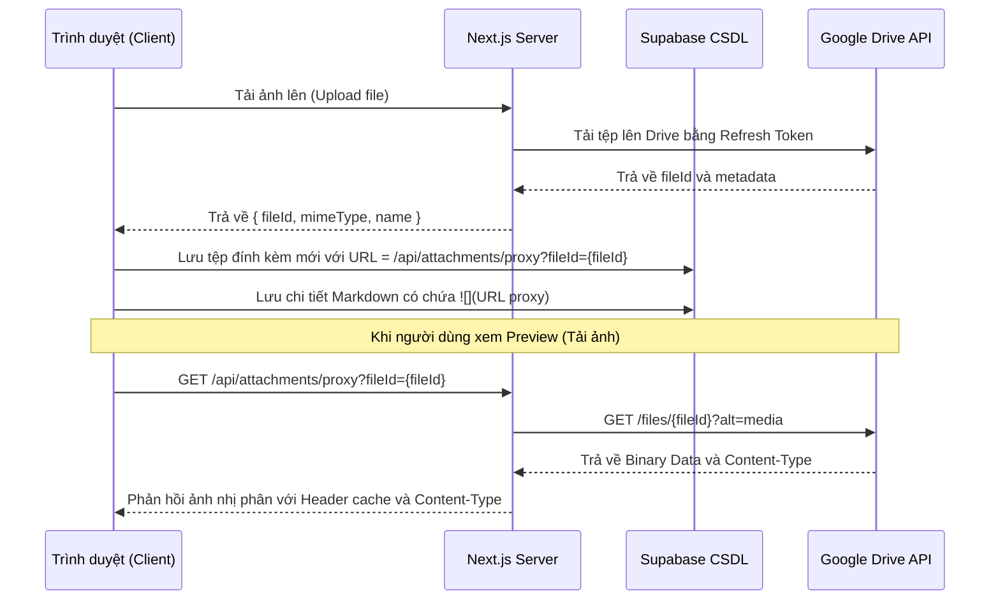

# Design Spec: Thiết kế Next.js API Proxy Cho Ảnh Drive & Tối Ưu Hóa Giao Diện Modal, Popover

Bản đặc tả thiết kế chi tiết để giải quyết triệt để lỗi không hiển thị hình ảnh từ Google Drive bằng cơ chế Server-side Proxy, cùng các tối ưu hóa giao diện (auto-resize mô tả, giới hạn chiều cao popover, ngắt dòng văn bản, đồng bộ Markdown cho mô tả công việc ở cả Modal và Popover).

---

## 1. Thành phần và Kiến trúc

### 1.1 API Proxy hình ảnh (`/api/attachments/proxy`)
- **Mục tiêu:** Cung cấp link ảnh trung gian từ server Next.js để trình duyệt tải trực tiếp, không qua domain Google Drive nhằm tránh bị chặn cookie.
- **Nguyên lý:**
  - Nhận tham số `fileId` từ query string.
  - Sử dụng Google OAuth credentials ở phía server (Refresh Token) để lấy Access Token.
  - Gọi API Google Drive lấy file nhị phân: `GET https://www.googleapis.com/drive/v3/files/{fileId}?alt=media`.
  - Stream dữ liệu file nhị phân về trình duyệt kèm `Content-Type` thích hợp và cấu hình cache client `Cache-Control`.
- **Cấu trúc URL mới trong Markdown:** `/api/attachments/proxy?fileId={fileId}`

### 1.2 Mô tả công việc dạng Markdown & Tự động lưu không cần nút bấm

#### A. Trong Popover di chuột (`CardPopover.tsx`)
- Loại bỏ hoàn toàn hai nút "Lưu" và "Hủy".
- Bấm vào mô tả để mở ô nhập liệu `<textarea>` (ô nhập này có cơ chế tự động co giãn).
- Khi mất focus (`onBlur`), hệ thống tự động gọi hàm `handleSaveDescription` để cập nhật cơ sở dữ liệu và quay trở lại chế độ Preview Markdown.
- Sử dụng thư viện `marked` để render nội dung mô tả đồng nhất.

#### B. Trong Modal chi tiết (`CardDetailModal.tsx`)
- Thêm hai nút chuyển đổi chế độ **"Soạn thảo"** và **"Xem trước"** giống hệt như phần Chi tiết công việc.
- Khi Modal được mở, mặc định phần Mô tả luôn ở chế độ **"Xem trước"** (Preview Mode).
- Ô nhập Mô tả công việc ở chế độ Soạn thảo có tính năng co giãn tự động theo chiều cao văn bản và tự động lưu khi mất focus (`onBlur`).

### 1.3 Giới hạn chiều cao và thanh cuộn cho Popover (Card Hover Popover)
- **Mục tiêu:** Ngăn không cho Popover của thẻ hiển thị tràn xuống dưới cạnh màn hình gây mất nội dung.
- **Nguyên lý:** Cập nhật CSS class của Popover trong [CardPopover.tsx](file:///c:/WORKSPACE/TaskManagementWeb/my-task-app/src/components/CardPopover.tsx), đặt `max-h-[80vh] overflow-y-auto` để tự xuất hiện thanh cuộn dọc khi Popover quá dài.

### 1.4 Khắc phục lỗi tràn chữ (Word Wrap / Break Words)
- **Mục tiêu:** Ngăn không cho các liên kết URL dài hoặc từ dài trong Markdown preview và Textarea phá vỡ chiều ngang container.
- **Nguyên lý:**
  - Bổ sung `word-break: break-word` và `overflow-wrap: break-word` cho `.markdown-content` trong [globals.css](file:///c:/WORKSPACE/TaskManagementWeb/my-task-app/src/app/globals.css).
  - Thêm class `break-words` vào các `textarea` trong [CardDetailModal.tsx](file:///c:/WORKSPACE/TaskManagementWeb/my-task-app/src/components/CardDetailModal.tsx).

---

## 2. Luồng xử lý và Tương tác (Sequence & Data Flow)

---

## 3. Kế hoạch kiểm thử & Xác minh
- **Kiểm thử Preview ảnh:** Biên tập chi tiết công việc, tải ảnh lên, chuyển sang chế độ Preview và xác minh ảnh được hiển thị trơn tru, không có lỗi console về 3rd-party cookies.
- **Kiểm thử Mô tả trong Popover:** Click sửa mô tả trong Popover, gõ nội dung, click ra ngoài vùng soạn thảo và xác minh nội dung được tự lưu mà không cần nút bấm, sau đó hiển thị dạng Markdown.
- **Kiểm thử Mô tả trong Modal:** Mở Modal, xác minh Mô tả đang ở tab "Xem trước". Click sang tab "Soạn thảo", sửa nội dung, click ra ngoài và xác minh dữ liệu được lưu tự động.
