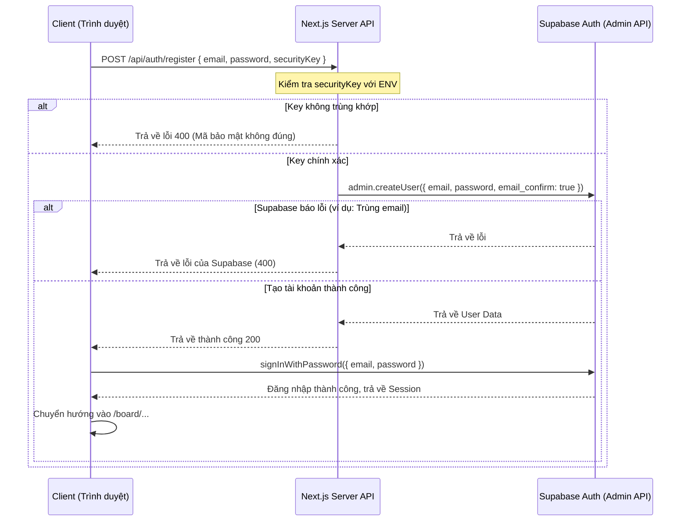

# Design Spec: Đăng Ký Tài Khoản Bảo Mật Qua Next.js Server API & Mã Bảo Mật

Bản đặc tả thiết kế chi tiết cơ chế hạn chế đăng ký tự do, yêu cầu nhập mã bảo mật hợp lệ được xác thực tại Server API Next.js trước khi tạo tài khoản bằng Supabase Admin API.

---

## 1. Thành phần và Kiến trúc

### 1.1 Next.js API Route Đăng ký (`/api/auth/register`)
- **Mục tiêu:** Nhận thông tin đăng ký tài khoản mới từ Client, xác thực mã bảo mật bí mật trên Server, và gọi API Admin của Supabase để tạo tài khoản.
- **Biến môi trường cần thiết (Server-only):**
  - `REGISTRATION_SECURITY_KEY`: Mã đăng ký bí mật do Admin quy định (ví dụ: `my-super-secret-key-123`).
  - `SUPABASE_SERVICE_ROLE_KEY`: Khóa dịch vụ admin của Supabase dùng để vượt qua xác thực email và bỏ qua cài đặt cấm đăng ký tự do.
  - `NEXT_PUBLIC_SUPABASE_URL`: Đường dẫn URL kết nối tới Supabase.
- **Hoạt động:**
  - Nhận phương thức `POST` chứa `{ email, password, securityKey }`.
  - Nếu `securityKey !== process.env.REGISTRATION_SECURITY_KEY`, trả về lỗi `400` với thông báo *"Mã đăng ký bảo mật không chính xác!"*.
  - Khởi tạo Supabase Admin Client bằng `SUPABASE_SERVICE_ROLE_KEY`:
    ```typescript
    const supabaseAdmin = createClient(supabaseUrl, process.env.SUPABASE_SERVICE_ROLE_KEY);
    ```
  - Gọi API Admin để tạo user và tự động xác thực email:
    ```typescript
    const { data, error } = await supabaseAdmin.auth.admin.createUser({
      email,
      password,
      email_confirm: true
    });
    ```
  - Nếu có lỗi (email đã tồn tại, mật khẩu yếu...), chuyển tiếp thông điệp lỗi của Supabase về Client.
  - Nếu thành công, trả về trạng thái `200` thành công.

### 1.2 Giao diện Đăng ký (`src/app/page.tsx`)
- Thêm ô nhập liệu mới: **"Mã đăng ký bảo mật"** khi ở chế độ Đăng ký (`authMode === "signup"`).
- Khi Submit Form Đăng ký:
  - Gửi request `POST` lên `/api/auth/register` thay vì gọi trực tiếp `supabase.auth.signUp()`.
  - Khi API trả về thành công, lập tức tự động đăng nhập người dùng bằng email và mật khẩu đó (`supabase.auth.signInWithPassword()`).
  - Chuyển hướng người dùng vào không gian làm việc (Board) ngay lập tức mà không cần xác thực email.

---

## 2. Luồng dữ liệu đăng ký (Sequence Diagram)



---

## 3. Kế hoạch kiểm thử & Xác minh (Verification Plan)
- **Kiểm thử mã sai:** Nhập sai mã đăng ký bảo mật, kiểm tra xem hệ thống có chặn lại và hiển thị thông báo lỗi chính xác hay không.
- **Kiểm thử mã đúng:** Nhập đúng mã đăng ký bảo mật, kiểm tra xem tài khoản được tạo thành công và tự động đăng nhập thẳng vào hệ thống mà không cần check hòm thư.
- **Kiểm thử RLS & Supabase:** Xác minh người dùng tạo mới vẫn có thể xem/sửa bảng bình thường dựa trên UUID của họ.
