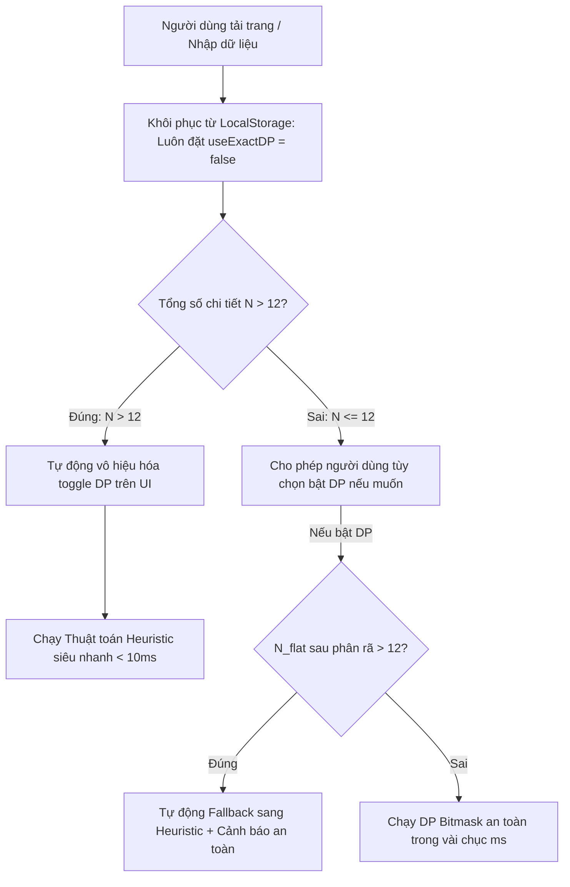

# Thiết kế Hệ thống An toàn Chống Treo DP & Bộ Kiểm Định Bất Biến Cắt Gỗ (No-Overlap Invariant Validator)

## 1. Tổng quan & Vấn đề Cần Giải Quyết

Trang **Tối ưu Cắt & Ghép Ván Gỗ** (`/wood-cut`) có 2 vấn đề vận hành quan trọng cần xử lý triệt để:

1. **Hiện tượng Treo Trình Duyệt / Vòng Lặp Vô Tận khi dùng DP (Infinite Freeze Loop)**:
   - Thuật toán chính xác DP Bitmask (`solveGroundTruthDP`) có độ phức tạp hàm mũ $O(3^N)$.
   - Khi người dùng bật tính năng `useExactDP = true` với đơn hàng có $N > 12$ chi tiết (hoặc chi tiết lớn bị phân rã thành nhiều mảnh con), việc tính toán tự động trong `useEffect` sẽ chiếm dụng 100% CPU của luồng chính JS, làm treo tab trình duyệt.
   - Khi người dùng F5 hoặc reload lại trang, trạng thái `useExactDP: true` và danh sách chi tiết lớn được nạp lại từ `localStorage`, kích hoạt lại hàm tính toán DP ngay khi vừa mount $\rightarrow$ Tạo thành **vòng lặp treo trang vô tận**, người dùng không thể thao tác để tắt DP hay chỉnh sửa dữ liệu.

2. **Yêu cầu Chứng minh Tính Đúng Đắn Tuyệt Đối (Zero-Bug Proofing)**:
   - Cần một cơ chế kiểm định toán học tự động (Mathematical Invariant Validator) để kiểm tra trên hàng trăm ca cắt ngẫu nhiên rằng:
     - 100% không có chi tiết nào bị đè lên nhau (kể cả khoảng bù mạch cưa `kerf`).
     - 100% không có chi tiết nào vượt ra ngoài kích thước ván gốc.
     - 100% tuân thủ quy tắc khóa vân gỗ (`orientation: "vertical"` / `"horizontal"` / `"auto"`).
     - 100% bảo toàn số lượng và tính liên tục của các tấm ghép vượt khổ.

---

## 2. Giải Pháp Kỹ Thuật

### 2.1. Bộ Bảo Vệ Chống Treo Đa Tầng (Multi-Layer DP Safety Guard)

1. **Khử Treo khi Khởi Động (LocalStorage Sanitization)**:
   - Trong `src/app/wood-cut/page.tsx`, khi nạp trạng thái từ `localStorage`, luôn ghi đè `useExactDP: false`.
   - Đảm bảo mỗi khi mở tab mới hoặc reload, trang web luôn tải tức thì với động cơ Heuristic (< 5ms).

2. **Hard Safety Cap ở Tầng Thuật Toán (`solveGroundTruthDP`)**:
   - Sau khi phân rã các tấm vượt khổ (`decomposeOversizedPieces`), kiểm tra `N_flat = flatCutItems.length`.
   - Nếu `N_flat > 12`, lập tức gọi `calculateWoodCut` và trả về kết quả an toàn kèm cờ `isFallbackToHeuristic: true`, ngăn chặn tuyệt đối tình trạng CPU bị quá tải.

3. **Giao Diện Trực Quan (UI Safety Guard & Feedback)**:
   - Khi $N > 12$, disable toggle DP và hiển thị badge/thông báo giải thích rõ ràng cho người dùng: *"Đơn hàng có > 12 chi tiết — hệ thống tự động sử dụng thuật toán Heuristic tối ưu để đảm bảo tốc độ phản hồi tức thì."*

---

### 2.2. Bộ Kiểm Định Bất Biến Hình Học (`src/lib/woodCuttingValidator.ts`)

Xây dựng module `validateCuttingPlanIntegrity(result, stockSheets, pieces, config)` kiểm tra 5 bất biến toán học:

1. **No-Overlap Invariant (Không đè hình)**:
   - Với mọi tấm ván $S$ và mọi cặp chi tiết $(A, B)$ trên $S$ ($A \ne B$):
     Bắt buộc thỏa mãn ít nhất một trong 4 điều kiện phân tách:
     $$(A.x + A.length + \text{kerf} \le B.x) \lor (B.x + B.length + \text{kerf} \le A.x) \lor (A.y + A.width + \text{kerf} \le B.y) \lor (B.y + B.width + \text{kerf} \le A.y)$$
2. **Boundary Invariant (Giới hạn ván gốc)**:
   - $A.x \ge 0 \land A.y \ge 0 \land (A.x + A.length \le S.length) \land (A.y + A.width \le S.width)$.
3. **Grain Orientation Invariant (Hướng vân gỗ)**:
   - Nếu chi tiết gốc có `orientation: "vertical"` hoặc `allowRotation: false`: Bắt buộc $A.rotated = \text{false}$.
   - Nếu chi tiết gốc có `orientation: "horizontal"`: Bắt buộc $A.rotated = \text{true}$.
4. **Quantity Invariant (Bảo toàn số lượng)**:
   - Tổng số lượng chi tiết xuất hiện trên tất cả các tấm ván phải đúng bằng tổng $\sum p.quantity$.
5. **Decomposition Invariant (Tính hợp lệ của tấm ghép)**:
   - Kích thước mọi mảnh ghép con $\ge \text{minSubPieceSize}$.

---

## 3. Kế Hoạch Kiểm Thử & Đo Kiểm Tự Động

1. **Unit Test Bộ Kiểm Định (`src/lib/__tests__/woodCuttingValidator.test.ts`)**:
   - Kiểm tra phát hiện chính xác các ca đè hình giả lập, ca tràn viền, ca vi phạm hướng xoay.
2. **Stress Invariant Test trên 100+ Test Cases Ngẫu Nhiên**:
   - Chạy 100 ca kiểm thử ngẫu nhiên với đủ loại kích thước, số lượng chi tiết, và kiểm tra qua `validateCuttingPlanIntegrity` $\rightarrow$ 100% hợp lệ.
3. **Kiểm Thử Khử Vòng Lặp Treo DP (`src/app/wood-cut/__tests__/page.test.tsx`)**:
   - Giả lập `localStorage` chứa `useExactDP: true` và 20 chi tiết $\rightarrow$ Đảm bảo component mount mượt mà và chuyển về `useExactDP: false`.

---

## 4. Danh Mục File Tác Động

- `src/lib/woodCuttingValidator.ts`: [MỚI] Module kiểm định bất biến hình học & chống đè hình.
- `src/lib/cp/dpGroundTruthOptimizer.ts`: Bổ sung Hard Cap $N \le 12$ và cơ chế fallback an toàn.
- `src/app/wood-cut/page.tsx`: Cập nhật LocalStorage sanitization và badge cảnh báo an toàn DP.
- `src/lib/__tests__/woodCuttingValidator.test.ts`: [MỚI] Test suite kiểm định bất biến toán học.
