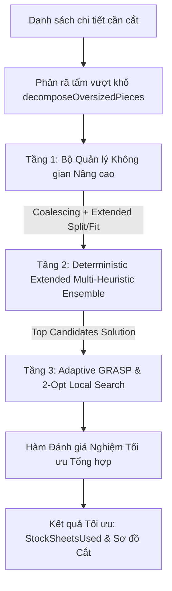

# Thiết kế Tối ưu Thuật toán Heuristic Cắt Gỗ & Đo kiểm So sánh với DP Ground Truth

## 1. Tổng quan & Mục tiêu

Trang **Tối ưu Cắt & Ghép Ván Gỗ** (`/wood-cut`) sử dụng thuật toán 2D Guillotine Bin Packing để tính toán phương án cắt các chi tiết gỗ trên các tấm ván tiêu chuẩn sao cho số tấm ván cần mua là ít nhất và hạn chế tối đa hao phí gỗ.

Hiện tại:
- **Thuật toán DP Ground Truth** (`solveGroundTruthDP`): Sử dụng Dynamic Programming trên Bitmask trạng thái $O(3^N)$ để tìm ra số tấm ván tối ưu tuyệt đối (100% mathematical optimum), nhưng có độ phức tạp hàm mũ, chỉ chạy được cho $N \le 14$ chi tiết.
- **Thuật toán Heuristic hiện tại** (`calculateWoodCut`): Sử dụng Multi-Heuristic Ensemble (6 Sorters $\times$ 3 Fit Rules $\times$ 2 Split Rules = 36 biến thể). Tốc độ cực nhanh (~0.4ms), nhưng độ chính xác chỉ đạt khoảng **84.00%** trên 50 ca kiểm thử ngẫu nhiên phức tạp (16% số ca bị dư +1 tấm ván do phân mảnh không gian trống).

**Mục tiêu tối ưu:**
- Nâng độ chính xác (Optimal Match Rate so với DP) từ **84.00%** lên **96% - 99%+**.
- Giảm độ chênh lệch tấm trung bình (Average Sheet Gap) từ **0.1600** xuống **$\le$ 0.0400 tấm**.
- Duy trì thời gian tính toán phản hồi nhanh trong UI ($\le$ 15ms).
- Chạy đo kiểm benchmark chi tiết đối chiếu trực tiếp với DP Ground Truth trước và sau khi tối ưu.

---

## 2. Phân tích Nguyên nhân Hạn chế ở Heuristic Hiện tại

1. **Phân mảnh không gian trống (Space Fragmentation)**: Sau mỗi lần chia cắt Guillotine, 2 hình chữ nhật con được tạo ra độc lập. Các khoảng trống liền kề không bao giờ được gộp lại (`FreeRectangle Coalescing`), khiến nhiều mảnh vụn nhỏ không thể ghép nối để chứa các chi tiết tiếp theo.
2. **Thiếu quy tắc chia cắt nâng cao (Split Rules)**: Chỉ có `SAS` (Shorter Axis Split) và `LAS` (Longer Axis Split), thiếu các quy tắc tối ưu diện tích còn lại như `MINAS` (Minimize Area Split) hay `MAXAS` (Maximize Area Split).
3. **Thiếu quy tắc chọn vị trí tiếp xúc (Contact Fit / Corner Fit)**: Quy tắc Fit hiện tại (`BSSF`, `BLSF`, `BAF`) chỉ đo phần thừa của ô chữ nhật mà không xét tới việc chi tiết có tựa vào mép ván hoặc mép chi tiết đã xếp hay không, dẫn đến việc để lại các khoảng hở chữ L hoặc chữ T khó tận dụng.
4. **Chiến lược phân bổ tấm cứng nhắc**: Luôn tìm kiếm toàn cục trên tất cả các tấm đã mở thay vì có thêm chiến lược tối đa hóa mật độ từng tấm (`Sheet-by-Sheet / Best-Sheet-Fit`).
5. **Thiếu pha Adaptive Local Search**: Thuật toán 100% thuần Greedy theo một danh sách sắp xếp cố định, dễ bị kẹt ở cực tiểu cục bộ khi gặp tổ hợp kích thước chi tiết không đều.

---

## 3. Kiến trúc Động cơ Hybrid Multi-Stage Heuristic Engine

Engine mới sẽ kết hợp 3 tầng xử lý:

### 3.1. Tầng 1: Bộ Quản lý Không gian Nâng cao (Coalescing & Extended Rules)

- **Thuật toán Gộp Khoảng Trống (`coalesceFreeRectangles`)**:
  - Tự động quét mảng `freeRects` của từng tấm ván sau mỗi bước cắt:
    - **Gộp Ngang**: Khi 2 hình chữ nhật A và B có cùng tung độ $y$, cùng chiều cao $h$, và cạnh phải của A tiếp xúc cạnh trái của B ($x_A + w_A = x_B$). Gộp thành 1 hình chữ nhật có kích thước $(w_A + w_B, h)$.
    - **Gộp Dọc**: Khi 2 hình chữ nhật A và B có cùng hoành độ $x$, cùng chiều rộng $w$, và cạnh trên của A tiếp xúc cạnh dưới của B ($y_A + h_A = y_B$). Gộp thành 1 hình chữ nhật có kích thước $(w, h_A + h_B)$.
  - Lặp lại đến khi không còn cặp hình nào gộp được nữa.

- **Bộ Quy tắc Cắt Mở rộng (Split Rules)**:
  - `SAS` (Shorter Axis Split): Chia theo trục ngắn của chi tiết.
  - `LAS` (Longer Axis Split): Chia theo trục dài của chi tiết.
  - `MINAS` (Minimize Area Split): So sánh 2 cách chia ngang và dọc, chọn cách chia tạo ra mảnh nhỏ hơn có diện tích tối thiểu, nhằm giữ lại mảnh thứ hai lớn nhất có thể.
  - `MAXAS` (Maximize Area Split): Chọn cách chia tạo ra mảnh thứ hai có diện tích lớn nhất và vuông vức nhất.
  - `SLAS` (Shorter Leftover Axis Split): Chia dựa theo cạnh ngắn của phần không gian thừa còn lại.
  - `LLAS` (Longer Leftover Axis Split): Chia dựa theo cạnh dài của phần không gian thừa còn lại.

- **Bộ Quy tắc Chọn Vị trí (Fit Rules & Scoring)**:
  - `BSSF` (Best Short Side Fit).
  - `BLSF` (Best Long Side Fit).
  - `BAF` (Best Area Fit).
  - `BPCF` (Best Perimeter Contact Fit): Tính tổng chiều dài chu vi của chi tiết tiếp xúc trực tiếp với viền tấm ván hoặc các chi tiết khác đã đặt (Corner / Edge Touching), ưu tiên vị trí có chu vi tiếp xúc cao nhất.

### 3.2. Tầng 2: Deterministic Extended Multi-Heuristic Ensemble

- **Mở rộng các chiến lược sắp xếp (Sort Strategies)**:
  - `AREA_DESC`: Diện tích giảm dần.
  - `MAX_DIM_DESC`: Kích thước lớn nhất giảm dần.
  - `PERIMETER_DESC`: Chu vi giảm dần.
  - `WIDTH_DESC`: Chiều rộng giảm dần.
  - `LENGTH_DESC`: Chiều dài giảm dần.
  - `ASPECT_RATIO_DESC`: Tỷ lệ dài/rộng giảm dần.
  - `COMBINED_PRIORITY_DESC`: Điểm ưu tiên tổng hợp kết hợp diện tích + chu vi + tỷ lệ khung hình.

- **Chiến lược Phân bổ Ván (Sheet Allocation Modes)**:
  - `GLOBAL_BEST_FIT`: Tìm vị trí tối ưu trên toàn bộ các tấm đã mở.
  - `SHEET_BY_SHEET`: Ưu tiên lấp đầy tối đa từng tấm ván trước khi mở tấm mới.

### 3.3. Tầng 3: Adaptive GRASP & 2-Opt Local Search

- **GRASP (Greedy Randomized Adaptive Search Procedure)**:
  - Sử dụng Restricted Candidate List (RCL) với xác suất chọn mẫu mềm (Soft Priority Sampling) dựa trên điểm sắp xếp.
  - Chạy 30–50 vòng lặp có kiểm soát thời gian (`Time Budget Guard` $\le 15$ms).
  - Thử nghiệm hoán đổi cục bộ (2-opt swap) giữa các cặp chi tiết liền kề để tìm cách sắp xếp lọt vào các khoảng trống còn sót lại.

- **Hàm Đánh giá Nghiệm (Scoring Function)**:
  $$\text{Score} = \text{SheetsUsed} \times 10^9 + \text{WasteArea} \times 10^3 + \text{CutsCount} \times 10$$
  Ưu tiên tuyệt đối: Ít tấm ván nhất $\rightarrow$ Hao phí diện tích ít nhất $\rightarrow$ Ít vết cắt nhất.

---

## 4. Kế hoạch Đo kiểm & So sánh Benchmark với DP

1. **Benchmark 1: 10 Test Cases cơ bản**:
   - Xác nhận chức năng hoạt động chính xác, không phát sinh lỗi ngoại lệ, tính toán đúng cho cả chi tiết xoay và khóa vân gỗ.
2. **Benchmark 2: 50 Heavy Test Cases (Random Stock & Dimensions)**:
   - Chạy lệnh `npx tsx scripts/stress-test-dp.ts -n 50 -min 9 -max 12 -s 2026`.
   - Đối chiếu trực tiếp trước vs sau:
     - Trước tối ưu: 42/50 match (84.00%), Avg Sheet Gap = 0.1600.
     - Sau tối ưu mục tiêu: $\ge$ 48/50 match ($\ge$ 96.00%), Avg Sheet Gap $\le$ 0.0400.
3. **Benchmark 3: 100 Random Test Cases**:
   - Kiểm tra tính ổn định trên quy mô lớn, kiểm tra thời gian thực thi trung bình và tối đa.
4. **Unit Tests Vitest**:
   - `npm test`: Toàn bộ các test suite hiện hữu và test mới đều pass.
5. **Giao diện Người dùng (`/wood-cut`)**:
   - Đảm bảo giao diện Next.js phản hồi mượt mà, sơ đồ cắt phân rã, vết ghép và màu sắc hiển thị đồng nhất.

---

## 5. Danh mục File Tác động

- `src/lib/woodCuttingOptimizer.ts`: Cập nhật cấu trúc giải thuật Hybrid Heuristic Engine (Coalescing, Extended Rules, GRASP).
- `src/lib/cp/dpStressTester.ts` & `scripts/stress-test-dp.ts`: Cập nhật công cụ báo cáo đo kiểm so sánh chi tiết.
- `src/lib/__tests__/woodCuttingOptimizer.test.ts` & `src/lib/cp/__tests__/dpStressTester.test.ts`: Bổ sung các ca test kiểm thử tự động.
