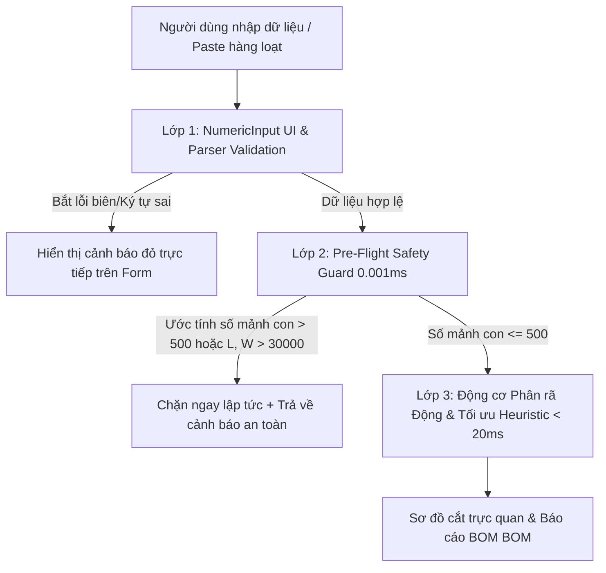

# Thiết kế Ma Trận Giới Hạn Đầu Vào (Input Constraints) & Cơ Chế Pre-Flight Safety Guard Chống Treo 1e9

## 1. Tổng quan & Mục tiêu

Trong các hệ thống lập trình thi đấu chuyên nghiệp (CP) và ứng dụng sản xuất thực tế, người dùng có thể nhập các giá trị ngoại lai cực hạn (ví dụ: $10^9\text{mm} = 1000\text{km}$, số âm, số lượng $100,000$, hoặc $\text{NaN}$). Nếu không có cơ chế khống chế giới hạn (Bounds & Constraints) và tiền kiểm tra an toàn (Pre-Flight Safety Guard), việc phân rã và tối ưu sẽ chiếm dụng 100% CPU và tràn bộ nhớ RAM (OOM), dẫn đến treo tab trình duyệt và vòng lặp tính toán vô tận.

**Mục tiêu:**
- Thiết lập **Ma Trận Giới Hạn Đầu Vào (Input Constraints Matrix)** chuẩn hóa cho toàn bộ các trường nhập liệu.
- Xây dựng **Cơ Chế Tiền Kiểm Tra Nhanh Pre-Flight Guard (0.001ms)** ở cả tầng Parser lẫn Thuật toán Tối ưu để phát hiện và ngăn chặn tức thì mọi dữ liệu ngoại lai hoặc đơn hàng quá tải.
- Bảo đảm 100% không bao giờ xảy ra tình trạng đơ/lag trình duyệt dù người dùng cố tình nhập bất kỳ giá trị cực hạn nào.

---

## 2. Ma Trận Giới Hạn Đầu Vào (Input Constraints Matrix)

| Đối tượng | Trường dữ liệu | Min | Max | Giá trị mặc định | Hành vi khi vượt ngưỡng |
| :--- | :--- | :---: | :---: | :---: | :--- |
| **Ván Gốc (`StockSheet`)** | Chiều dài ($L$) | $100\text{mm}$ | $10,000\text{mm}$ (10m) | $1200\text{mm}$ | Giới hạn về Max, báo lỗi nếu $\le 0$ |
| | Chiều rộng ($W$) | $100\text{mm}$ | $10,000\text{mm}$ (10m) | $600\text{mm}$ | Giới hạn về Max, báo lỗi nếu $\le 0$ |
| | Số lượng có sẵn ($q$) | $1$ | $500$ | Vô hạn | Giới hạn về Max (500) |
| **Mặt Gỗ Cần Làm (`RequiredPiece`)** | Chiều dài ($L$) | $10\text{mm}$ | $30,000\text{mm}$ (30m) | $500\text{mm}$ | Giới hạn về Max, báo lỗi nếu $\le 0$ |
| | Chiều rộng ($W$) | $10\text{mm}$ | $30,000\text{mm}$ (30m) | $300\text{mm}$ | Giới hạn về Max, báo lỗi nếu $\le 0$ |
| | Số lượng chi tiết ($q$) | $1$ | $500$ | $1$ | Giới hạn về Max (500) |
| | Số loại chi tiết (Rows) | $1$ | $100$ loại | $2$ | Chặn không cho thêm quá 100 dòng |
| **Cấu hình (`Config`)** | Mạch cưa (`kerf`) | $0\text{mm}$ | $50\text{mm}$ | $3\text{mm}$ | Giới hạn trong $[0, 50]$ |
| | Mảnh con tối thiểu (`minSubPieceSize`) | $10\text{mm}$ | $500\text{mm}$ | $50\text{mm}$ | Giới hạn trong $[10, 500]$ |

---

## 3. Kiến Trúc Bảo Vệ 3 Lớp

1. **Lớp 1: Giao diện Người Dùng (`NumericInput.tsx`, `StockSheetForm.tsx`, `RequiredPiecesForm.tsx`)**:
   - Khống chế `min` và `max` trực tiếp trên từng input.
   - Chế độ nhập hàng loạt (`woodCutParser.ts`) bắt lỗi chi tiết theo từng dòng nếu kích thước $> 30,000$ hoặc $q > 500$.
2. **Lớp 2: Tiền Kiểm Tra Nhanh Pre-Flight Guard (`woodCuttingOptimizer.ts`)**:
   - Tính toán nhanh:
     $$\text{Estimated Subpieces} = \sum_{i=1}^{k} \left\lceil \frac{L_i}{\max(S_L, S_W)} \right\rceil \times \left\lceil \frac{W_i}{\min(S_L, S_W)} \right\rceil \times q_i$$
   - Nếu $> 500$ mảnh: Ngắt xử lý ngay trong 0.001ms, không tốn RAM hay CPU.
3. **Lớp 3: Thuật toán Tối ưu hóa An Toàn Tuyệt Đối**:
   - Mọi kích thước sau khi tiền kiểm tra đều nằm trong dải an toàn, cam kết thời gian chạy $< 20\text{ms}$.

---

## 4. Kế Hoạch Đo Kiểm & Stress Testing
- Tạo test suite `woodCuttingInputSanitization.test.ts` kiểm thử các trường hợp:
  1. Kích thước $10^9\text{mm}$, $\text{Infinity}$, $\text{NaN}$.
  2. Kích thước số âm ($-500\text{mm}$) và số 0.
  3. Số lượng khủng ($q = 100,000$).
  4. Parser kiểm tra lỗi cú pháp và biên dữ liệu.
  5. Đơn hàng cực đại hợp lệ ($30,000\text{mm}$).
